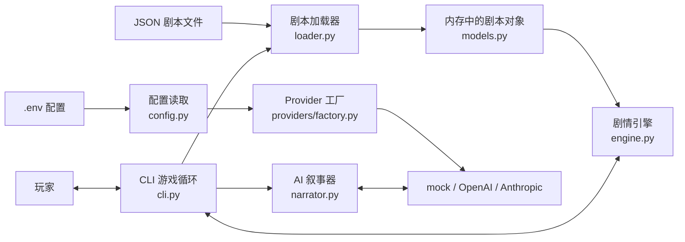
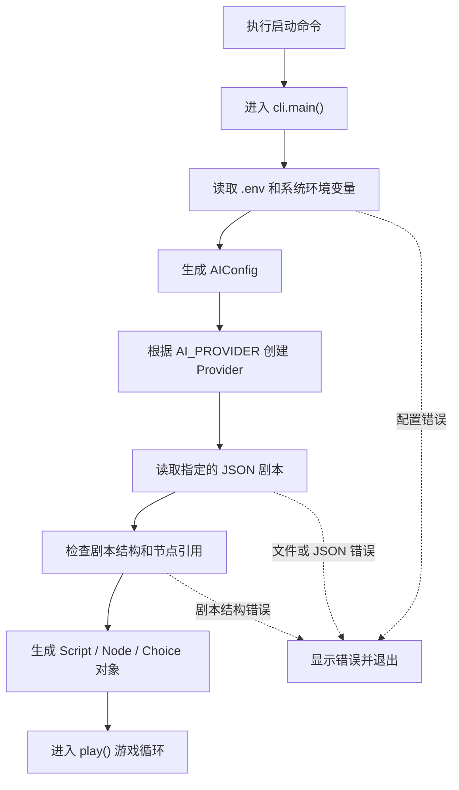
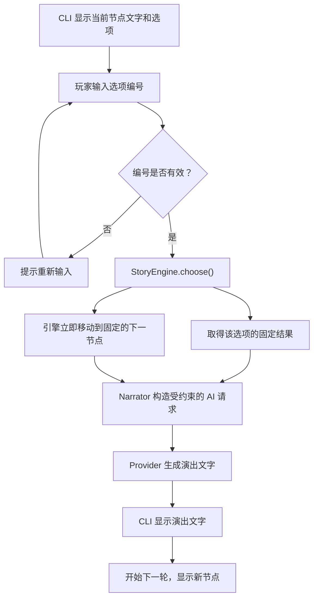
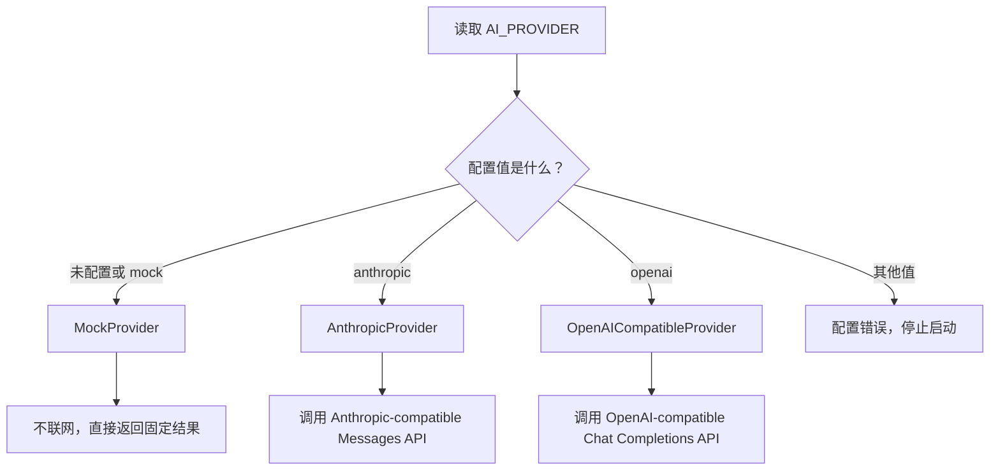
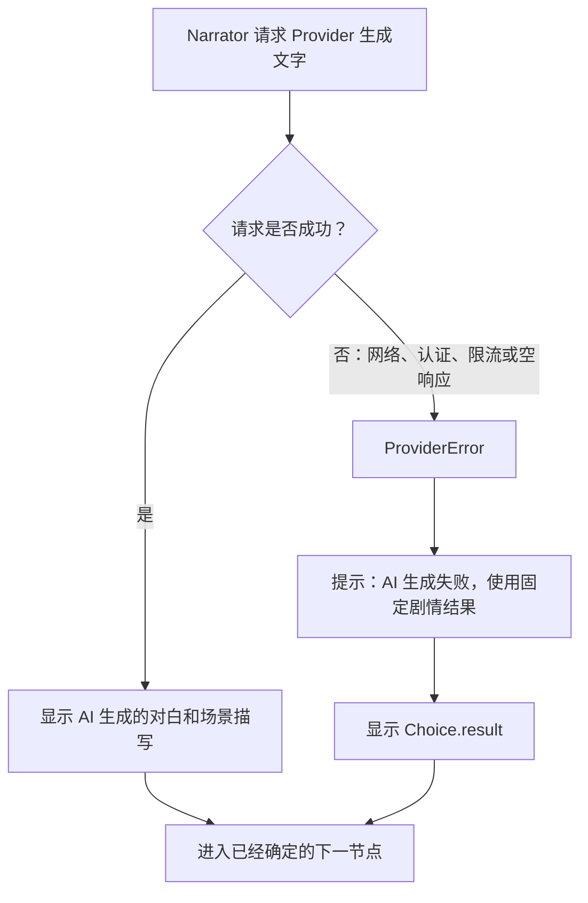
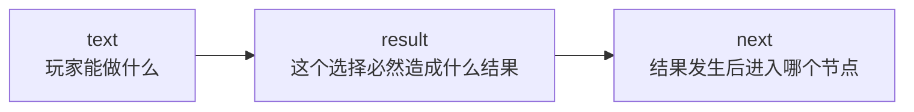

# StoryRail 架构说明

这份文档不要求你熟悉 Python。它主要回答三个问题：程序从哪里开始、玩家选择后发生了什么、AI 在系统里能做什么和不能做什么。

## 一句话理解 StoryRail

StoryRail 是一个“剧本控制轨道，AI 负责演出”的文字冒险游戏引擎。

- JSON 剧本提前决定可选项、固定结果和下一个剧情节点。
- 剧情引擎先执行固定规则，再让 AI 补充对白、动作和场景描写。
- 即使 AI 请求失败，剧情也能使用剧本里的固定结果继续运行。

换句话说，AI 是演员，不是编剧，也不是裁判。

## 核心概念

| 名称 | 通俗解释 | 例子 |
| --- | --- | --- |
| Script（剧本） | 一整个可游玩的故事 | 《雨夜相遇》 |
| Node（节点） | 当前所在的一幕 | 在雨夜的街道上遇见少女 |
| Choice（选项） | 玩家现在可以做的动作 | 停下来帮助她 |
| Result（固定结果） | 选择后必须发生的事情 | 少女接受了帮助 |
| Next Node（下一节点） | 固定结果发生后进入的一幕 | 屋檐下交谈 |
| Provider | 具体使用哪一种 AI 服务 | mock、OpenAI-compatible、Anthropic-compatible |
| Narrator（叙事器） | 把固定剧情整理成提示词交给 Provider | 将固定结果写成自然的对白和描写 |

## 1. 整体架构



可以把 `cli.py` 理解成总调度员：它不负责解析 JSON，不负责决定剧情规则，也不直接调用某一家 AI。它只是把各个模块按正确顺序连接起来。

各模块的职责边界如下：

- `loader.py`：读取并检查 JSON，把原始数据转换成程序能使用的剧本对象。
- `models.py`：定义 Script、Node 和 Choice 三种数据的形状。
- `engine.py`：保存当前位置，执行玩家选择，并移动到固定的下一节点。
- `narrator.py`：根据当前场景、玩家选择、固定结果和下一场景构造 AI 请求。
- `providers/`：屏蔽不同 AI 接口之间的差异。
- `cli.py`：显示文字、接收输入，并组织整个游戏循环。

## 2. 游戏启动流程

启动命令：

```powershell
& .\.venv\Scripts\python.exe -m storyrail.cli .\examples\rainy-night\script.json
```



启动阶段有两条相互独立的数据来源：

1. `.env` 决定“用不用 AI、使用哪种接口和模型”。
2. `script.json` 决定“故事有哪些节点、选项和结局”。

这两类配置不会混在一起。切换模型不需要修改剧本，修改剧本也不需要修改 Provider 代码。

## 3. 玩家做出一次选择后的调用流程

这是整个项目最重要的一张图。



实际顺序是“引擎先决定，AI 后描写”：

1. CLI 取得玩家选中的 Choice。
2. `StoryEngine.choose()` 读取 Choice 中的 `result` 和 `next`。
3. 引擎先把当前位置改成 `next` 指向的节点。
4. Narrator 收集当前场景、玩家选择、固定结果和下一场景。
5. Provider 只能基于这些已经确定的信息生成自然语言。
6. CLI 显示生成结果，然后进入下一轮。

因此，AI 响应得再有创意，也不能改变 `next`，更不能临时创建新选项。

## 4. AI Provider 选择流程

CLI 没有 `--ai` 参数。程序启动时自动读取 `.env` 中的 `AI_PROVIDER`。



三个 Provider 都实现相同的简单能力：接收一个 `GenerationRequest`，返回一段玩家可见的文字。因此，Narrator 和 CLI 不需要知道底层是哪一家模型服务。

### 为什么默认是 mock？

mock 模式完全不联网，直接显示剧本的固定结果。它适合：

- 没有配置 API 密钥时试玩游戏。
- 开发剧本时快速检查节点跳转。
- 自动化测试时避免真实请求和费用。

## 5. AI 失败时如何回退

AI 只是演出层，所以 AI 故障不能阻断剧情规则。



注意：调用 AI 之前，剧情引擎已经完成节点跳转。因此无论 AI 成功还是失败，玩家都会进入同一个下一节点。变化的只有表现文字，不是剧情事实。

## 6. JSON 剧本如何控制剧情

每个普通节点包含若干固定选项。每个选项最重要的三个字段是：

```json
{
  "text": "停下来询问她是否需要帮助",
  "result": "你撑伞走近，少女接受了你的帮助。",
  "next": "under_eaves"
}
```

它表达的规则是：



- `text` 会显示给玩家。
- `result` 是不可被 AI 改变的剧情事实，也是 AI 失败时的回退文字；AI 可以换一种说法演出它，但不能改变它实际发生了什么。
- `next` 是下一个节点的 ID，只由剧情引擎读取。

结局节点使用 `"ending": true`，没有选项。CLI 读到结局节点后显示结束提示并退出游戏循环。

## 7. 关键调用顺序速查

如果只想记住一次完整调用，可以看下面这条链：

```text
python -m storyrail.cli
  → cli.main()
  → config.load_ai_config()
  → providers.factory.create_provider()
  → loader.load_script()
  → cli.play()
  → StoryEngine.choose()
  → Narrator.narrate()
  → Provider.generate()
  → cli.play() 显示结果并继续下一轮
```

## 8. 想修改功能时看哪个文件

| 想做的事情 | 首先查看 |
| --- | --- |
| 修改启动参数或终端交互 | [`src/storyrail/cli.py`](../src/storyrail/cli.py) |
| 修改节点跳转规则 | [`src/storyrail/engine.py`](../src/storyrail/engine.py) |
| 修改 JSON 读取和基础校验 | [`src/storyrail/loader.py`](../src/storyrail/loader.py) |
| 修改 Script、Node、Choice 数据结构 | [`src/storyrail/models.py`](../src/storyrail/models.py) |
| 修改给 AI 的约束和提示词 | [`src/storyrail/narrator.py`](../src/storyrail/narrator.py) |
| 修改 Provider 选择规则 | [`src/storyrail/providers/factory.py`](../src/storyrail/providers/factory.py) |
| 修改 `.env` 配置读取 | [`src/storyrail/config.py`](../src/storyrail/config.py) |
| 接入新的 AI 接口 | [`src/storyrail/providers/`](../src/storyrail/providers/) |
| 查看标准剧本结构 | [`templates/script.json`](../templates/script.json) |
| 查看完整示例 | [`examples/rainy-night/script.json`](../examples/rainy-night/script.json) |
| 查看 JSON Schema | [`schemas/script.schema.json`](../schemas/script.schema.json) |

## 9. 当前架构边界

当前版本刻意保持简单：

- 只有 CLI，没有前端页面。
- 使用 JSON 和文件夹管理内容，没有数据库。
- 没有存档恢复功能。
- 没有长期对话记忆。
- 没有 AI 动态创建选项或修改节点。
- 没有流式输出。

未来即使增加前端或数据库，也应继续保持核心原则：剧情引擎决定事实，AI 只负责受约束的表现层。
